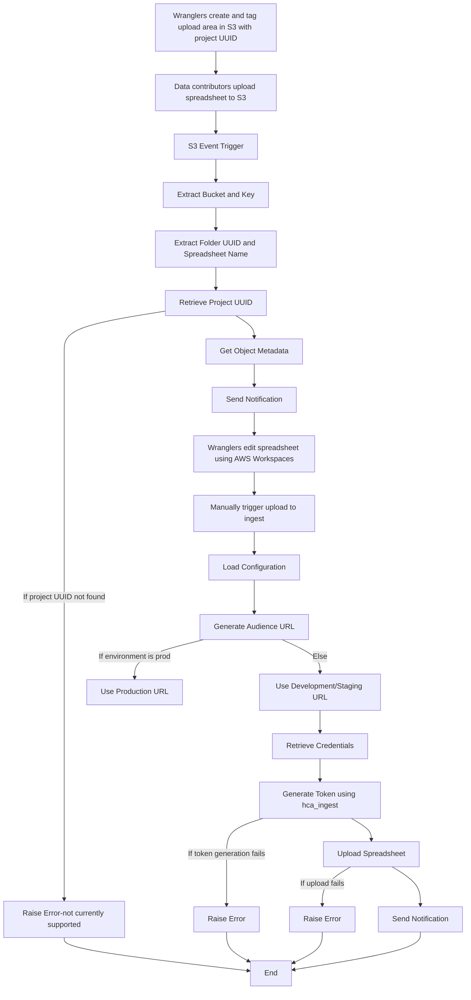

# Secure Spreadsheet Upload Lambda Deployment

This guide provides step-by-step instructions to deploy the AWS Lambda function for the secure spreadsheet upload process using Docker and Amazon Elastic Container Registry (ECR).

## Table of Contents

1. [General Description](#general-description)
2. [Prerequisites](#prerequisites)
3. [Existing AWS Resources](#existing-aws-resources)
4. [Deployment](#deployment)
5. [Running Tests](#running-tests)

## General Description

The purpose of the Lambda functions dcp-secure-spreadsheet-upload/notify_upload and dcp-secure-spreadsheet-upload/ingest_upload is to handle the secure upload of spreadsheet files and the subsequent notification and ingestion processes.

- **dcp-secure-spreadsheet-upload/notify_upload**: Detects uploads to the designated S3 bucket, extracts the project UUID from the folder tags, and sends a notification.
- **dcp-secure-spreadsheet-upload/ingest_upload**: Uploads the spreadsheet to the ingest system using an API call, triggered (currently) by wranglers.

Users (wranglers) can create and tag upload areas using the `hca-util` tool. For more details on how to use `hca-util` to create upload areas, see the [hca-util repository](https://github.com/ebi-ait/hca-util).


For more details, see also the following documents:
- [Managed access dataset - Data and metadata review and export SOP](https://docs.google.com/document/d/14cp5cOIdc11JQVSqOh21Ev4aRWSOBh3TLMxC1yE4tj4/edit#heading=h.dp9owg4pqrw9)
- [Managed access dataset - Data Transfer SOP](https://docs.google.com/document/d/1Ho-s39yfc9gxFH_cyOreBbiOngpsiWBm3DtgY97tkpA/edit?pli=1#heading=h.5uilta56du84)

### Authentication System

The token authentication system uses the `hca_ingest` client to generate tokens. Google service account credentials are retrieved from the environment variable and loaded into the client. For more details, see the [hca_ingest repository](https://github.com/ebi-ait/ingest-client).

## Flowchart



## Prerequisites

Before you begin, ensure you have the following:

- **AWS CLI**: Installed and configured with appropriate permissions.
- **Docker**: Installed on your local machine.
- **IAM Role**: Ensure you have a role with necessary permissions for Lambda execution, S3 access, and SNS.
- **Amazon ECR**: Repository set up to store the Docker image.
- **AWS Account**: With access to Lambda, IAM, and ECR services.

## Existing AWS Resources

- **ECR Repository**: An ECR repository named `secure-spreadsheet-upload-repo` is already created. You can view it [here](https://us-east-1.console.aws.amazon.com/ecr/repositories/private/871979166454/secure-spreadsheet-upload-repo?region=us-east-1).
- **Lambda Function**: The Lambda function named `notify-spreadsheet-upload-function` is available [here](https://us-east-1.console.aws.amazon.com/lambda/home?region=us-east-1#/functions/notify-spreadsheet-upload-function?tab=code) and `dcp-secure-spreadsheet-upload-auth` [here](https://us-east-1.console.aws.amazon.com/lambda/home?region=us-east-1#/functions/dcp-secure-spreadsheet-upload-auth?tab=image).

## Deployment

   **Navigate to Project Directory**:

   ```bash
  cd /path/to/dcp-secure-spreadsheet-upload
  ```

### For notify-spreadsheet-upload-function

**Use the provided deploy_notify_upload.sh script to deploy the function.**

1. Ensure the script is executable:
   ```bash
   chmod +x deploy_notify_upload.sh

2. Run the deployment script:
   ```bash
   ./deploy_notify_upload.sh
   
### For dcp-secure-spreadsheet-upload-auth

1. **Build the Docker Image**:
   ```bash
   docker build -t secure-spreadsheet-upload -f ingest_upload/Dockerfile .

2. **Tag the Docker Image:**
   Replace <account-id> and <region> with your AWS account ID and region.
   ```bash
   docker tag secure-spreadsheet-upload:latest 871979166454.dkr.ecr.us-east-1.amazonaws.com/secure-spreadsheet-upload-repo:latest

3. **Authenticate Docker to ECR:**
   ```bash
   aws ecr get-login-password --region us-east-1 | docker login --username AWS --password-stdin 871979166454.dkr.ecr.us-east-1.amazonaws.com

4. **Push the Docker Image to ECR:**
   ```bash
   docker push 871979166454.dkr.ecr.us-east-1.amazonaws.com/secure-spreadsheet-upload-repo:latest

   ####  Creating/Updating the Lambda Function
      If creating a new function:
      ```bash
      aws lambda create-function \
      --function-name dcp-secure-spreadsheet-upload-auth \
      --package-type Image \
      --code ImageUri=871979166454.dkr.ecr.us-east-1.amazonaws.com/secure-spreadsheet-upload-repo:latest \
      --role arn:aws:iam::871979166454:role/lambda-execution-role \
      --profile your-aws-profile
      ```
   
      If updating an existing function:
      ```bash
      aws lambda update-function-code \
      --function-name dcp-secure-spreadsheet-upload-auth \
      --image-uri 871979166454.dkr.ecr.us-east-1.amazonaws.com/secure-spreadsheet-upload-repo:latest \
      --profile your-aws-profile
      ```

## Running Tests

### Setting Up the Test Environment

1. **Install the required packages:**
   ```bash
   pip install -r requirements.txt

2. **Run the tests using pytest:**
   ```bash
   pytest tests/

### Environment Variables for Lambda
- **TOPIC_NAME**: The name of the SNS topic.
- **MY_AWS_REGION**: The AWS region where your SNS topic is located.
- **GOOGLE_APPLICATION_CREDENTIALS**: The JSON credentials file which is required for authenticating and generating tokens using the hca_ingest client.
