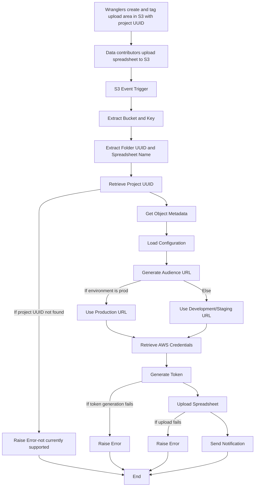

# Secure Spreadsheet Upload Lambda Deployment

This guide provides step-by-step instructions to deploy the AWS Lambda function for the secure spreadsheet upload process using Docker and Amazon Elastic Container Registry (ECR).

## Table of Contents

1. [General Description](#general-description)
2. [Prerequisites](#prerequisites)
3. [Existing AWS Resources](#existing-aws-resources)
4. [Building the Docker Image](#building-the-docker-image)
5. [Tagging and Pushing to ECR](#tagging-and-pushing-to-ecr)
6. [Creating/Updating the Lambda Function](#creatingupdating-the-lambda-function)
7. [Running Tests](#running-tests)

## General Description

The purpose of the Lambda function `dcp-secure-spreadsheet-upload-auth` is to securely upload spreadsheet files to ingest. Data contributors upload a spreadsheet in a designated upload area that has been tagged with the project UUID. The Lambda function detects these uploads, extracts the project UUID, and securely transfers the spreadsheet to ingest via an API call to the broker for the correct project.

Users (wranglers) can create and tag upload areas using the `hca-util` tool. For more details on how to use `hca-util` to create upload areas, see the [hca-util repository](https://github.com/ebi-ait/hca-util).


For more details, see also the following documents:
- [Managed access dataset - Data and metadata review and export SOP](https://docs.google.com/document/d/14cp5cOIdc11JQVSqOh21Ev4aRWSOBh3TLMxC1yE4tj4/edit#heading=h.dp9owg4pqrw9)
- [Managed access dataset - Data Transfer SOP](https://docs.google.com/document/d/1Ho-s39yfc9gxFH_cyOreBbiOngpsiWBm3DtgY97tkpA/edit?pli=1#heading=h.5uilta56du84)

## Flowchart



## Prerequisites

Before you begin, ensure you have the following:

- **AWS CLI**: Installed and configured with appropriate permissions.
- **Docker**: Installed on your local machine.
- **IAM Role**: The function retrieves credentials from AWS Secrets Manager to make authorized requests to the ingest service, ensuring that the upload process is secure and properly authenticated.
  Ensure you have a role with necessary permissions for Lambda execution, S3 and Secrets Manager access.
- **Amazon ECR**: Repository set up to store the Docker image.
- **AWS Account**: With access to Lambda, IAM, and ECR services.

## Existing AWS Resources

- **ECR Repository**: An ECR repository named `secure-spreadsheet-upload-repo` is already created. You can view it [here](https://us-east-1.console.aws.amazon.com/ecr/repositories/private/871979166454/secure-spreadsheet-upload-repo?region=us-east-1).
- **Lambda Function**: The Lambda function named `dcp-secure-spreadsheet-upload-auth` is available. You can view it [here](https://us-east-1.console.aws.amazon.com/lambda/home?region=us-east-1#/functions/dcp-secure-spreadsheet-upload-auth?tab=image).

## Building the Docker Image

1. **Navigate to Project Directory**:
   ```bash
   cd /path/to/dcp-secure-spreadsheet-upload

2. **Build the Docker Image**:
   ```bash
   docker build -t secure-spreadsheet-upload .

##  Tagging and Pushing to ECR

1. **Tag the Docker Image:**
   Replace <account-id> and <region> with your AWS account ID and region.
   ```bash
   docker tag secure-spreadsheet-upload:latest 871979166454.dkr.ecr.us-east-1.amazonaws.com/secure-spreadsheet-upload-repo:latest

2. **Authenticate Docker to ECR:**
   ```bash
   aws ecr get-login-password --region us-east-1 | docker login --username AWS --password-stdin 871979166454.dkr.ecr.us-east-1.amazonaws.com

3. **Push the Docker Image to ECR:**
   ```bash
   docker push 871979166454.dkr.ecr.us-east-1.amazonaws.com/secure-spreadsheet-upload-repo:latest

##  Creating/Updating the Lambda Function

1. **Create or Update Lambda Function:**
   If creating a new function:
   ```bash
   aws lambda create-function \
   --function-name dcp-secure-spreadsheet-upload-auth \
   --package-type Image \
   --code ImageUri=871979166454.dkr.ecr.us-east-1.amazonaws.com/secure-spreadsheet-upload-repo:latest \
   --role arn:aws:iam::871979166454:role/lambda-execution-role \
   --profile your-aws-profile
   ```
   
   If updating an existing function:
      ```bash
      aws lambda update-function-code \
      --function-name dcp-secure-spreadsheet-upload-auth \
      --image-uri 871979166454.dkr.ecr.us-east-1.amazonaws.com/secure-spreadsheet-upload-repo:latest \
      --profile your-aws-profile
   ```

## Running Tests

### Setting Up the Test Environment

1. **Install the required packages:**
   ```bash
   pip install -r requirements.txt

2. **Run the tests using pytest:**
   ```bash
   pytest tests/

### Environment Variables for Lambda
- **TOPIC_NAME**: The name of the SNS topic.
- **MY_AWS_REGION**: The AWS region where your SNS topic is located.
